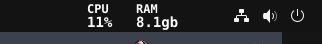
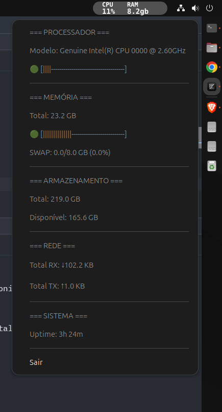

# Monitor Tray

Um aplicativo completo de monitoramento de sistema que exibe informações detalhadas em tempo real na system tray (bandeja do sistema). Desenvolvido em Rust para máxima performance e baixo consumo de recursos.

## 📋 Características

- ✅ **Monitoramento completo em tempo real** - Atualizações a cada 50ms
- ✅ **Interface visual dinâmica** com gráficos de barra coloridos:
  - 🟢 **Verde**: Uso baixo (< 50%)
  - 🟡 **Amarelo**: Uso médio (50-80%)
  - 🔴 **Vermelho**: Uso alto (> 80%)
- ✅ **Menu contextual completo** com informações detalhadas do sistema
- ✅ **Gráficos de barra visuais** para CPU e memória
- ✅ **Informações completas**:
  - **CPU**: Modelo, cores, frequência, uso com gráfico, load average
  - **Memória**: Total, usada, disponível, SWAP com porcentagens
  - **Armazenamento**: Espaço total, usado, disponível por disco
  - **Rede**: Tráfego RX/TX total e por interface
  - **Sistema**: Uptime formatado
- ✅ **Sistema tray nativo** - Integração perfeita com o desktop
- ✅ **Atualização sem piscar** - Interface fluida e responsiva
- ✅ **Compatibilidade ampla** - Unity, GNOME, KDE e outros ambientes desktop Linux
- ✅ **Baixo consumo de recursos** - Escrito em Rust para máxima eficiência

## 🖥️ Interface

### Ícone da System Tray


O aplicativo exibe na system tray as informações de CPU e RAM com cores dinâmicas baseadas no uso.

### Menu Completo do Sistema


Menu contextual detalhado com:
- **Processador**: Modelo, gráfico de uso em tempo real, load average
- **Memória**: Informações de RAM e SWAP com gráficos visuais
- **Armazenamento**: Espaço total e detalhes por disco/partição  
- **Rede**: Tráfego de dados por interface
- **Sistema**: Tempo de atividade (uptime)

### Gráficos de Barra Visuais
Os gráficos de barra usam caracteres Unicode para uma visualização clara:
- **🟢 [||||||||||||--------]** - Uso baixo (verde)
- **🟡 [|||||||||||||||||---]** - Uso médio (amarelo)  
- **🔴 [||||||||||||||||||||]** - Uso alto (vermelho)

As barras são atualizadas em tempo real (50ms) sem piscar ou recriar o menu.

## 📦 Instalação

### Via pacote .deb (Ubuntu/Debian)

1. Baixe o arquivo `.deb` da seção [Releases](releases)
2. Instale o pacote:
```bash
sudo dpkg -i monitor-tray-deb.deb
sudo apt-get install -f  # instala dependências se necessário
```

### Dependências do sistema
O aplicativo requer as seguintes bibliotecas:
- `libgtk-3-0`
- `libglib2.0-0`
- `libappindicator3-1`

## 🚀 Execução

Após a instalação, você pode:

1. **Executar via linha de comando:**
```bash
monitor-tray
```

2. **Executar via menu de aplicações:**
Procure por "Monitor Tray" no launcher de aplicações

3. **Inicialização automática:**
O aplicativo está configurado para aparecer nas opções de inicialização automática do sistema

## 🛠️ Desenvolvimento

### Pré-requisitos

- Rust 1.70+ ([rustup.rs](https://rustup.rs/))
- Dependências de desenvolvimento do GTK:

**Ubuntu/Debian:**
```bash
sudo apt update
sudo apt install build-essential pkg-config libgtk-3-dev libglib2.0-dev libappindicator3-dev
```

**Fedora:**
```bash
sudo dnf install gcc pkg-config gtk3-devel glib2-devel libappindicator-gtk3-devel
```

**Arch Linux:**
```bash
sudo pacman -S base-devel pkgconf gtk3 glib2 libappindicator-gtk3
```

### Clone e execução

```bash
# Clone o repositório
git clone <repository-url>
cd monitor-tray

# Execute em modo de desenvolvimento
cargo run

# Ou execute com logs detalhados
RUST_LOG=debug cargo run
```

### Build de produção

```bash
# Gerar executável otimizado
cargo build --release

# O executável estará em:
# ./target/release/monitor-tray
```

### Gerar pacote com autostart .deb

```bash
# 1. Dar permissão ao script de build
chmod +x build-autostart.sh

# 2. Executar o script de build
./build-autostart.sh

# O arquivo monitor-tray-deb.deb será criado

# 3, Instale o pacote:
sudo dpkg -i sudo dpkg -i releases/monitor-tray-autostart-deb.deb
sudo apt-get install -f  # instala dependências se necessário
```

### Gerar pacote sem autostart .deb

```bash
# 1. Dar permissão ao script de build
chmod +x build.sh

# 2. Executar o script de build
./build.sh

# O arquivo monitor-tray-deb.deb será criado

# 3, Instale o pacote:
sudo dpkg -i sudo dpkg -i releases/monitor-tray-deb.deb
sudo apt-get install -f  # instala dependências se necessário
```

### Estrutura do projeto

```
monitor-tray/
├─ src/
│  ├─ main.rs          # Código principal da aplicação
│  └─ monitor.rs       # Módulo de monitoramento do sistema
├─ assets/
│  ├─ menu.png         # Screenshot do menu detalhado
│  └─ tray.png         # Screenshot do ícone na tray
├─ releases/           # Arquivos de distribuição (.deb)
├─ Cargo.toml          # Dependências e configuração
├─ README.md           # Este arquivo
├─ build.sh            # Script de build do pacote .deb
├─ build-autostart.sh  # Script de build com autostart
└─ target/
   └─ release/
      └─ monitor-tray  # Executável otimizado
```

## 🔧 Tecnologias utilizadas

- **[Rust](https://www.rust-lang.org/)** - Linguagem de programação para máxima performance
- **[sysinfo](https://crates.io/crates/sysinfo)** - Coleta completa de informações do sistema
- **[libappindicator](https://crates.io/crates/libappindicator)** - Sistema tray nativo no Linux
- **[GTK](https://www.gtk.org/)** - Interface gráfica, menus e widgets
- **[tokio](https://tokio.rs/)** - Runtime assíncrono para atualizações em tempo real
- **SVG** - Geração dinâmica de ícones coloridos
- **Unicode** - Gráficos de barra visuais (🟢🟡🔴)

## 🐛 Resolução de problemas

### O ícone não aparece na system tray
- Verifique se seu ambiente desktop suporta system tray
- No GNOME, instale a extensão "TopIcons Plus" ou "AppIndicator Support"
- Reinicie o aplicativo após instalar extensões

### Erro de dependências
```bash
# Instale as dependências manualmente
sudo apt install libgtk-3-0 libglib2.0-0 libappindicator3-1
```

### Problemas de compilação
- Verifique se todas as dependências de desenvolvimento estão instaladas
- Atualize o Rust: `rustup update`

## 📄 Licença

Este projeto está sob a licença MIT. Veja o arquivo `LICENSE` para mais detalhes.

## 🤝 Contribuição

Contribuições são bem-vindas! Sinta-se à vontade para:

1. Fazer fork do projeto
2. Criar uma branch para sua feature (`git checkout -b feature/AmazingFeature`)
3. Commit suas mudanças (`git commit -m 'Add some AmazingFeature'`)
4. Push para a branch (`git push origin feature/AmazingFeature`)
5. Abrir um Pull Request

## 📞 Suporte

Se você encontrar algum problema ou tiver sugestões, por favor:
- Abra uma [issue](issues) no GitHub
- Descreva o problema detalhadamente
- Inclua informações do sistema (distribuição, versão, ambiente desktop)

---

**Monitor Tray** - Monitoramento de sistema simples e eficiente para Linux 🐧
