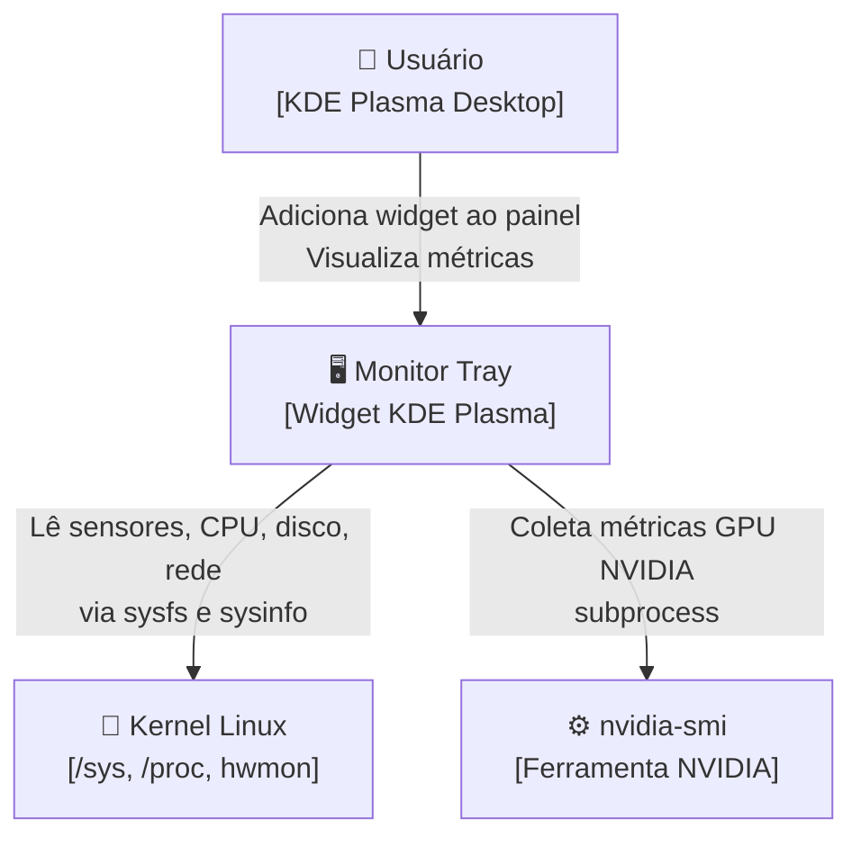
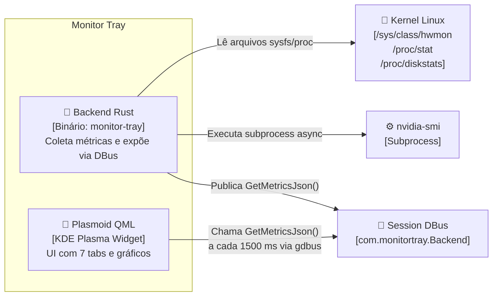
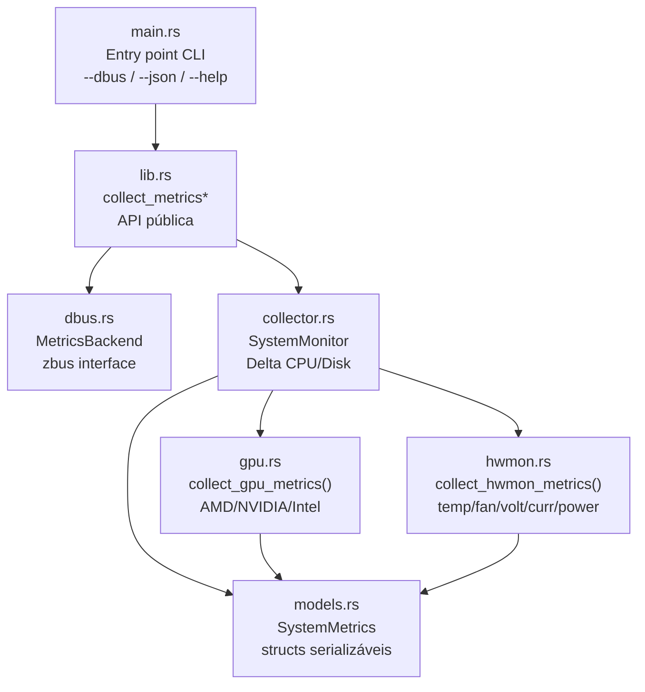
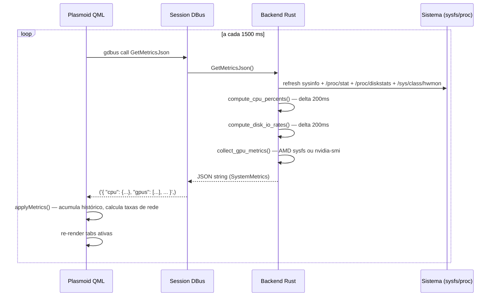

# Arquitetura — Monitor Tray

## Visão Geral

O Monitor Tray é um widget para **KDE Plasma** que exibe métricas do sistema em tempo real. A arquitetura separa coleta de dados (backend Rust) de apresentação (frontend QML) por meio de uma interface **DBus**.

---

## C4 — Contexto do Sistema

---

## C4 — Containers

---

## C4 — Componentes do Backend

---

## Fluxo de Dados

---

## Inventário de Módulos

| Módulo | Tipo | Responsabilidade |
|---|---|---|
| `src/main.rs` | Entry point | Parse de flags CLI; delega para `lib.rs` |
| `src/lib.rs` | API pública | Funções `collect_metrics*`; constantes DBus |
| `src/dbus.rs` | Serviço DBus | Expõe `GetMetricsJson` via `zbus` com `Mutex<SystemMonitor>` |
| `src/monitor/models.rs` | Modelos | Structs `#[derive(Serialize, Deserialize)]` para todo o payload |
| `src/monitor/collector.rs` | Coleta | `SystemMonitor`: delta de CPU/Disk, taxas de I/O, cache de GPU |
| `src/monitor/gpu.rs` | Coleta GPU | AMD via sysfs, NVIDIA via `nvidia-smi`, Intel via sysfs (limitado) |
| `src/monitor/hwmon.rs` | Sensores | Leitura de `temp/fan/in/curr/power` em `/sys/class/hwmon` |
| `plasma/…/main.qml` | Orchestração | Polling DBus, acúmulo de histórico, estado global |
| `plasma/…/FullRepresentation.qml` | Layout | TabBar fixa + ScrollView do conteúdo |
| `plasma/…/Theme.qml` | Design system | Paleta, espaçamentos, funções utilitárias (`fmtBytes`, `fmtUptime`…) |
| `plasma/…/components/` | UI reutilizável | `MetricCard`, `HeroMetric`, `HistoryChart`, `RingGauge`… |
| `plasma/…/tabs/` | Conteúdo das abas | `CpuTab`, `RamTab`, `GpuTab`, `DiskTab`, `NetworkTab`, `SensorsTab`, `SystemTab` |

---

## Decisões de Arquitetura

- [0001 — Backend Rust com interface DBus](adr/0001-backend-rust-dbus.md)
- [0002 — Monitoramento de GPU via sysfs e nvidia-smi](adr/0002-gpu-sysfs-nvidia-smi.md)
- [0003 — Serviço systemd do usuário para o backend](adr/0003-systemd-user-service.md)
