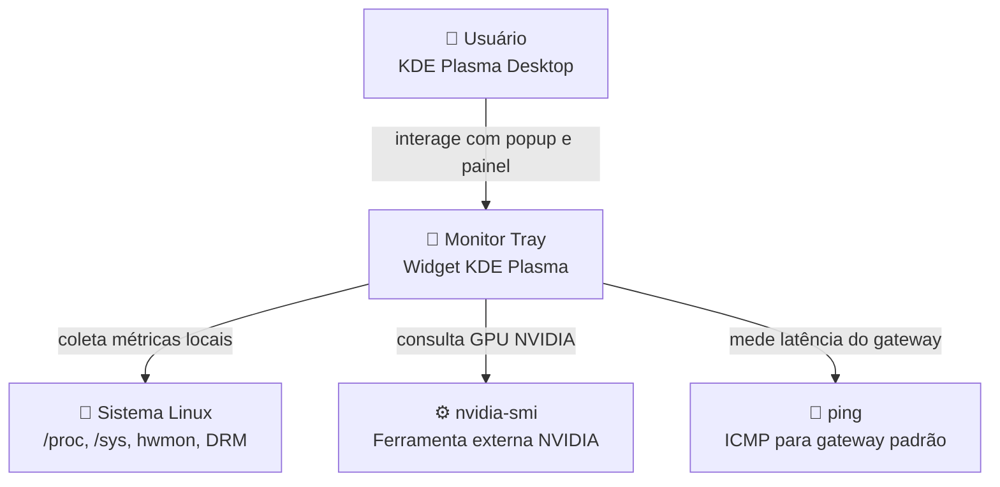
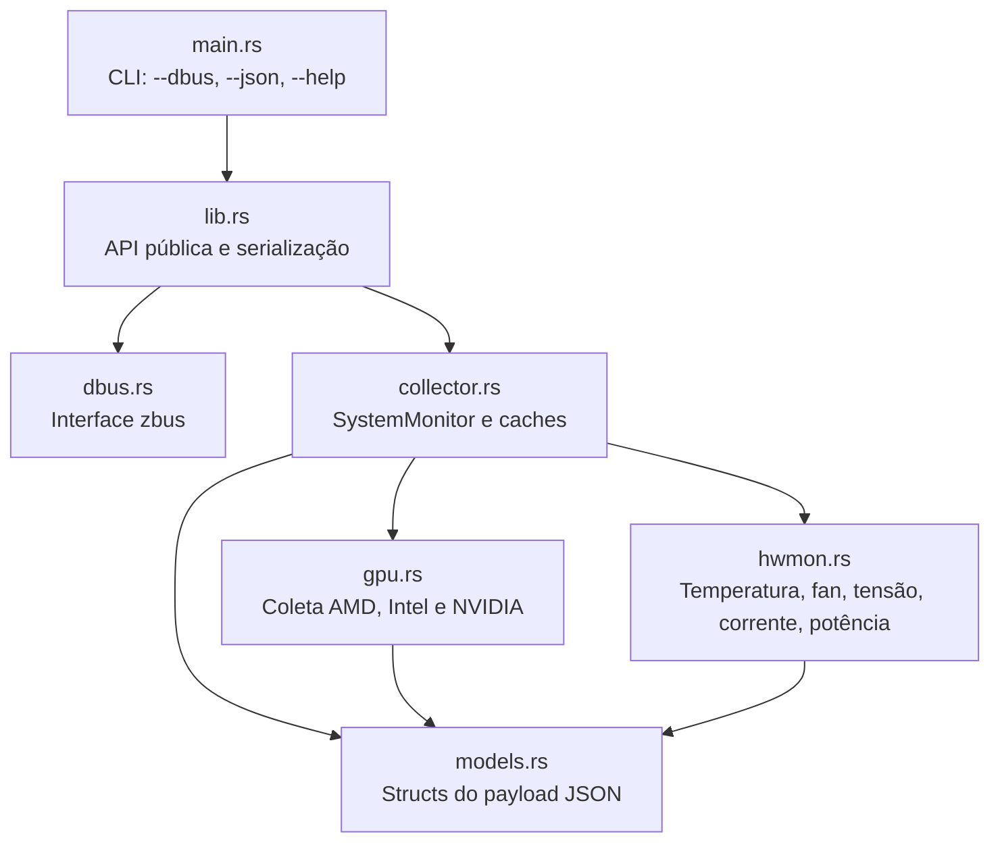
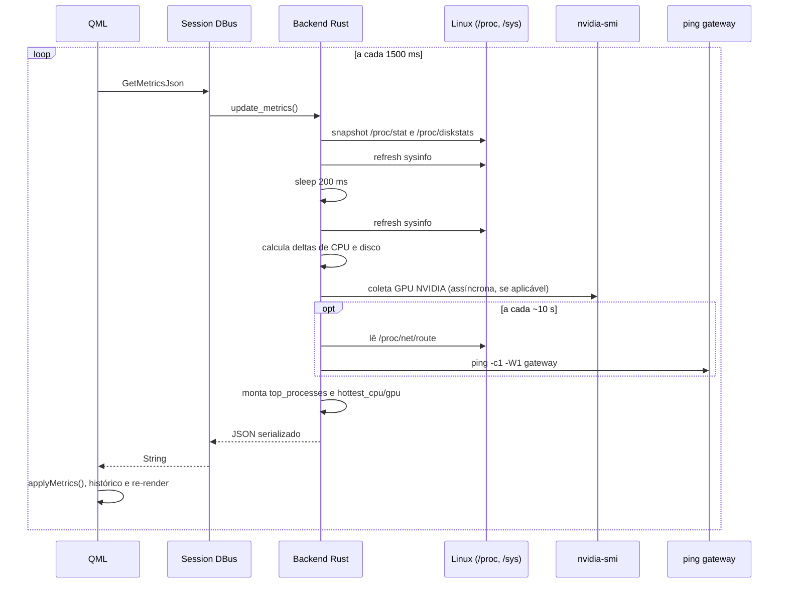

# Arquitetura — Monitor Tray

## Escopo desta documentação

Este documento é a referência técnica da arquitetura. Ele descreve **como o sistema funciona internamente** e quais módulos participam do fluxo de coleta e renderização.

> A `wiki/Architecture.md` existe como visão geral para contribuidores. Os detalhes de implementação e contrato ficam em `docs/`.

---

## Visão geral

O Monitor Tray separa a coleta de métricas do sistema da apresentação visual:

- **backend Rust**: coleta métricas Linux, mantém caches e expõe `GetMetricsJson()` via Session DBus;
- **frontend QML**: consulta o backend a cada `1500 ms`, mantém histórico local e renderiza 7 abas.

Essa separação evita lógica pesada no Plasmoid e concentra o acesso a `/proc`, `/sys` e subprocessos no binário Rust.

---

## C4 — Contexto do Sistema



---

## C4 — Containers

```mermaid
graph LR
    subgraph MonitorTray["Monitor Tray"]
        Backend["🦀 Backend Rust<br/>Binário monitor-tray<br/>Coleta e serializa métricas"]
        Frontend["🎨 Plasmoid QML<br/>Popup e representação compacta"]
    end

    DBus["🔌 Session DBus<br/>com.monitortray.Backend"]
    Linux["🐧 Linux<br/>/proc/stat, /proc/diskstats,<br/>/proc/net/route, /sys/class/*"]
    NvidiaSmi["⚙️ nvidia-smi<br/>Subprocesso assíncrono"]
    Ping["📶 ping -c1 -W1<br/>Subprocesso assíncrono"]

    Backend -->|lê arquivos e sysinfo| Linux
    Backend -->|consulta opcional| NvidiaSmi
    Backend -->|mede gateway a cada ~10s| Ping
    Backend -->|publica GetMetricsJson()| DBus
    Frontend -->|gdbus call a cada 1500 ms| DBus
```

---

## Componentes do backend



---

## Fluxo de dados



---

## Responsabilidades por camada

### Backend Rust

Responsável por:

- coletar CPU, memória, disco, rede, sensores e GPUs;
- calcular deltas de CPU e I/O de disco sobre janela de `200 ms`;
- detectar o gateway padrão e medir latência com cache;
- normalizar o uso de CPU por processo para `0–100%` do sistema total;
- serializar `SystemMetrics` em JSON.

### Frontend QML

Responsável por:

- consultar o DBus a cada `1500 ms`;
- calcular taxa instantânea de download/upload via delta local;
- manter histórico circular de CPU, RAM, GPU, disco e rede;
- renderizar as abas `CPU`, `RAM`, `GPU`, `Disk`, `Network`, `Sensors` e `System`.

---

## Inventário de módulos

| Módulo | Tipo | Responsabilidade |
|---|---|---|
| `src/main.rs` | entry point | Interpreta `--dbus`, `--json` e `--help` |
| `src/lib.rs` | API pública | Funções de coleta/serialização e constantes DBus |
| `src/dbus.rs` | serviço | Expõe `Ping` e `GetMetricsJson` via `zbus` |
| `src/monitor/collector.rs` | backend | `SystemMonitor`, deltas, caches e composição do payload |
| `src/monitor/gpu.rs` | backend | Coleta AMD/Intel via sysfs e NVIDIA via `nvidia-smi` |
| `src/monitor/hwmon.rs` | backend | Leitura de sensores em `/sys/class/hwmon` |
| `src/monitor/models.rs` | backend | Modelos serializáveis do payload JSON |
| `plasma/contents/ui/main.qml` | frontend | Polling DBus, histórico local, estado global |
| `plasma/contents/ui/FullRepresentation.qml` | frontend | Layout do popup com `TabBar` fixa |
| `plasma/contents/ui/CompactRepresentation.qml` | frontend | Resumo compacto no painel |
| `plasma/contents/ui/Theme.qml` | frontend | Paleta, espaçamentos e formatadores |
| `plasma/contents/ui/tabs/*.qml` | frontend | Implementação de cada aba |
| `plasma/contents/ui/components/*.qml` | frontend | Componentes reutilizáveis de UI |

---

## Pontos técnicos relevantes

### Gateway e latência

- o gateway padrão é lido de `/proc/net/route`;
- a latência é medida com `ping -c1 -W1`;
- a medição é limitada por `timeout(1500 ms)`;
- o subprocesso roda só a cada `7` ciclos de atualização, ou aproximadamente **10 segundos**;
- o valor fica em cache em `cached_gateway_ip` e `cached_gateway_latency_ms`.

### Processos

- `top_processes` é calculado a partir de `self.system.processes()`;
- os itens são ordenados por `cpu_percent` decrescente;
- `cpu_percent` é **normalizado por `core_count`**, para representar `0–100%` do sistema todo;
- o frontend exibe os 15 processos com maior uso de CPU na aba **System**.

### Sensores dedicados para CPU e GPU

Além do sensor mais quente global, o backend expõe:

- `hottest_cpu_celsius` / `hottest_cpu_label`;
- `hottest_gpu_celsius` / `hottest_gpu_label`.

Isso remove a necessidade de filtrar chips no QML para compor a temperatura principal das abas.

### GPU AMD

Para GPUs AMD, o backend lê também:

- `fan_rpm` via `fan1_input`;
- `fan_duty_percent` via `pwm1`, escalado de `0..255` para `0..100%`.

---

## Decisões de arquitetura relacionadas

- [0001 — Backend Rust com interface DBus](adr/0001-backend-rust-dbus.md)
- [0002 — Monitoramento de GPU via sysfs e nvidia-smi](adr/0002-gpu-sysfs-nvidia-smi.md)
- [0003 — Serviço systemd do usuário para o backend](adr/0003-systemd-user-service.md)
