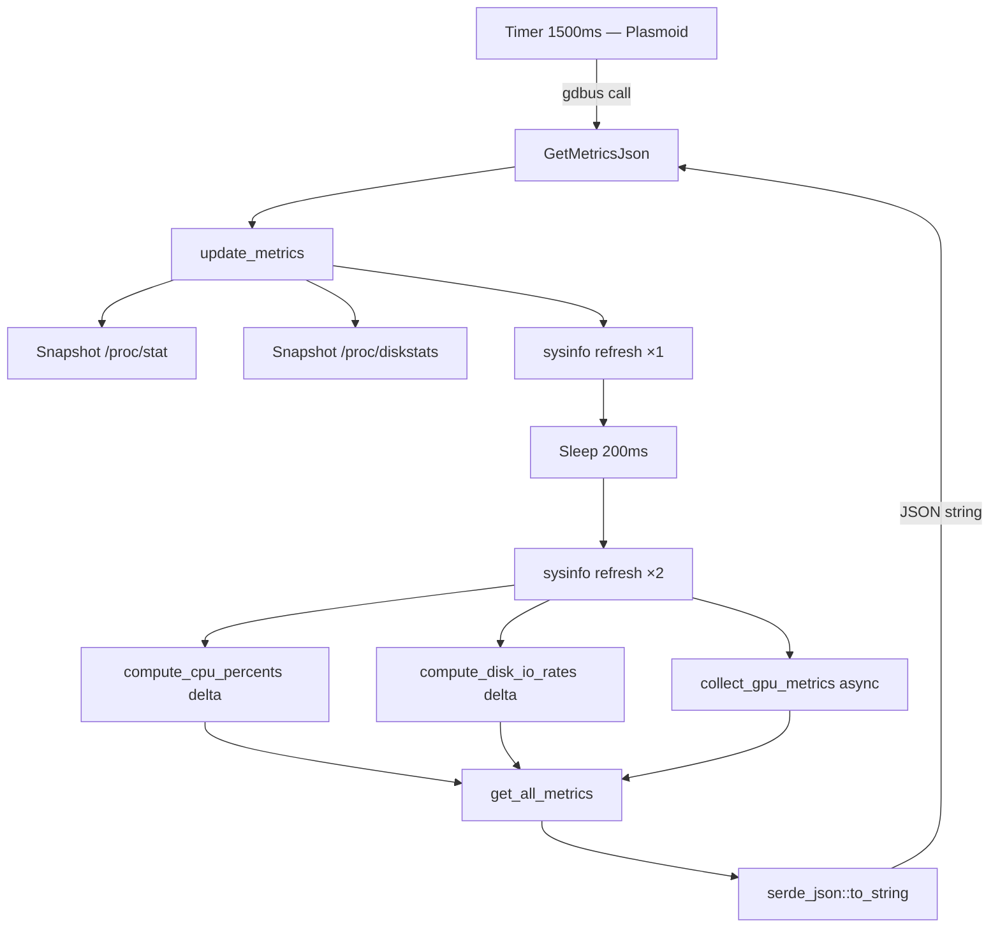

# Backend — Monitor Tray

O backend é um binário Rust que coleta métricas do sistema Linux e as expõe via **Session DBus** no formato JSON.

---

## Interface DBus

| Campo | Valor |
|---|---|
| Serviço | `com.monitortray.Backend` |
| Object Path | `/com/monitortray/Backend` |
| Interface | `com.monitortray.Backend` |

### Métodos

| Método | Retorno | Descrição |
|---|---|---|
| `Ping` | `&str` (`"ok"`) | Health check do serviço |
| `GetMetricsJson` | `String` (JSON) | Retorna `SystemMetrics` serializado |

**Exemplo de chamada manual:**
```bash
gdbus call --session \
  --dest com.monitortray.Backend \
  --object-path /com/monitortray/Backend \
  --method com.monitortray.Backend.GetMetricsJson
```

---

## Ciclo de Atualização



O intervalo de 200 ms entre dois `refresh_all()` do sysinfo garante que os percentuais de CPU sejam precisos, pois são calculados com base no **delta** de contadores acumulados.

---

## Coleta por Subsistema

### CPU — `/proc/stat` + sysinfo

| Campo | Fonte | Método |
|---|---|---|
| `usage_percent` | sysinfo | média de `cpu.cpu_usage()` por core |
| `user_percent` | `/proc/stat` | `(Δuser + Δnice) / Δtotal × 100` |
| `system_percent` | `/proc/stat` | `(Δsystem + Δirq + Δsoftirq) / Δtotal × 100` |
| `idle_percent` | `/proc/stat` | `(Δidle + Δiowait) / Δtotal × 100` |
| `steal_percent` | `/proc/stat` | `Δsteal / Δtotal × 100` (relevante em VMs) |
| `per_core_usage` | sysinfo | `Vec<f32>` — um valor por núcleo lógico |
| `frequency` | sysinfo | `cpu.frequency()` do primeiro core (MHz) |

### Memória — sysinfo

Valores em GB (`bytes / 1024³`). Campos: `total_memory`, `used_memory`, `available_memory`, `usage_percent`, `total_swap`, `used_swap`.

### Disco — sysinfo + `/proc/diskstats`

- **Espaço:** via `sysinfo::Disk` — total, used, available, usage%
- **I/O:** `/proc/diskstats` — delta de setores lidos/escritos sobre janela de 200 ms → bytes/seg

### Rede — sysinfo + `/sys/class/net`

- **Bytes acumulados:** `sysinfo::NetworkData::total_received/transmitted`
- **Taxas** (download/upload): calculadas no Plasmoid com base no delta temporal
- **Status:** `/sys/class/net/{iface}/operstate` — `"up"` e `"unknown"` são tratados como UP

### Sensores — `/sys/class/hwmon` + sysinfo fallback

Leitura direta de arquivos `temp*_input`, `fan*_input`, `in*_input`, `curr*_input`, `power*_input`. O chip é identificado pelo arquivo `name` do diretório hwmon. Se nenhum sensor for encontrado via hwmon, usa `sysinfo::Components` como fallback.

### GPU — sysfs + nvidia-smi

| Driver | Fonte | Dados coletados |
|---|---|---|
| `amdgpu` / `radeon` | `/sys/class/drm/cardN/device/` | uso%, VRAM, clocks (pp_dpm_sclk/mclk), temp, potência, fan RPM |
| `i915` / `xe` | `/sys/class/drm/cardN/gt/gt0/` | clock (rps_cur_freq_mhz), temp se hwmon i915 presente |
| `nvidia` | subprocess `nvidia-smi --format=csv,noheader,nounits` | uso%, VRAM (MiB), clocks, temp, potência |

---

## Modos do Binário

```bash
monitor-tray           # padrão: inicia backend DBus
monitor-tray --dbus    # inicia backend DBus explicitamente
monitor-tray --json    # imprime uma amostra de SystemMetrics e sai
monitor-tray --help    # exibe ajuda
```

---

## Testes

Os testes unitários ficam em `src/monitor/mod.rs` em módulo `#[cfg(test)]`.

| Teste | O que valida |
|---|---|
| `test_bytes_to_gb_converts_gibibytes` | Conversão de bytes para GB |
| `test_parse_sensor_index_extracts_numeric_suffix` | Parser de índice hwmon |
| `test_collect_hwmon_metrics_reads_fans_voltage_current_and_power` | Leitura de fixtures hwmon |
| `test_get_cpu_metrics_returns_zero_usage_when_system_has_no_cpu_snapshot` | CPU sem dados |
| `test_get_memory_metrics_returns_zero_usage_when_total_memory_is_zero` | Memória sem dados |
| `test_get_cpu_metrics_returns_consistent_shape_on_live_system` | Shape de métricas reais |
| `test_get_disk_metrics_aggregates_child_disks` | Agregação de discos |
| `test_get_network_metrics_totals_match_interface_sums` | Totais de rede |
| `test_get_sensor_metrics_returns_finite_temperatures_when_available` | Temperaturas finitas |
| `test_get_all_metrics_returns_non_negative_snapshot` | Snapshot completo |

Testes unitários em `src/monitor/collector.rs`:

| Teste | O que valida |
|---|---|
| `test_device_basename_extrai_nome_do_caminho` | Extração do basename de dispositivo |
| `test_compute_cpu_percents_distribui_corretamente` | Distribuição user/system/idle |
| `test_compute_cpu_percents_retorna_idle_total_sem_delta` | Idle 100% sem variação |
| `test_compute_cpu_percents_contabiliza_steal` | Steal time em VMs |
| `test_compute_disk_io_rates_converte_setores_para_bytes_por_seg` | Taxa de I/O de disco |
| `test_compute_disk_io_rates_ignora_dispositivos_ausentes_no_before` | Dispositivos novos |
