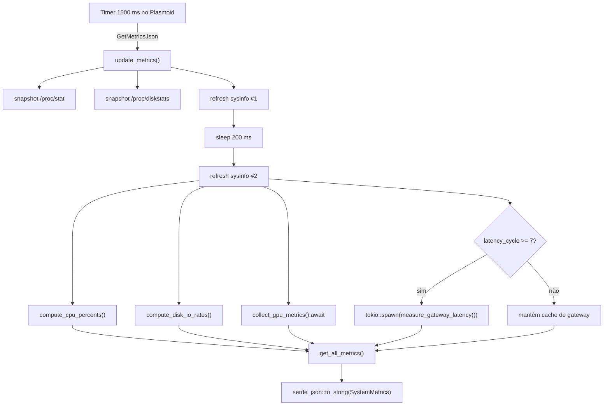

# Backend — Monitor Tray

O backend é um binário Rust que coleta métricas do sistema Linux e as expõe via **Session DBus** no formato JSON.

---

## Interface DBus

| Campo | Valor |
|---|---|
| Serviço | `com.monitortray.Backend` |
| Object Path | `/com/monitortray/Backend` |
| Interface | `com.monitortray.Backend` |

### Métodos

| Método | Retorno | Descrição |
|---|---|---|
| `Ping` | `&str` (`"ok"`) | Health check do serviço |
| `GetMetricsJson` | `String` (JSON) | Retorna `SystemMetrics` serializado |

**Exemplo de chamada manual:**

```bash
gdbus call --session \
  --dest com.monitortray.Backend \
  --object-path /com/monitortray/Backend \
  --method com.monitortray.Backend.GetMetricsJson
```

---

## Ciclo de atualização



### Janela de medição

O backend usa duas leituras separadas por `200 ms` para obter deltas confiáveis de:

- CPU (`/proc/stat` + `sysinfo`)
- I/O de disco (`/proc/diskstats`)

A latência de rede **não** é medida em todo ciclo. O ping ao gateway roda apenas a cada `7` ciclos, aproximadamente **10 segundos**, para evitar subprocessos excessivos e tráfego ICMP contínuo.

---

## Coleta por subsistema

### CPU — `/proc/stat` + sysinfo

| Campo | Fonte | Método |
|---|---|---|
| `usage_percent` | sysinfo | média de `cpu.cpu_usage()` por core |
| `user_percent` | `/proc/stat` | `(Δuser + Δnice) / Δtotal × 100` |
| `system_percent` | `/proc/stat` | `(Δsystem + Δirq + Δsoftirq) / Δtotal × 100` |
| `idle_percent` | `/proc/stat` | `(Δidle + Δiowait) / Δtotal × 100` |
| `steal_percent` | `/proc/stat` | `Δsteal / Δtotal × 100` |
| `per_core_usage` | sysinfo | `Vec<f32>` com um valor por núcleo lógico |
| `frequency` | sysinfo | frequência do primeiro core, em MHz |
| `name` | sysinfo | marca/modelo retornado por `brand()` |

### Memória — sysinfo

Valores em GB (`bytes / 1024³`):

- `total_memory`
- `used_memory`
- `available_memory`
- `usage_percent`
- `total_swap`
- `used_swap`

### Disco — sysinfo + `/proc/diskstats`

| Campo | Fonte | Observação |
|---|---|---|
| espaço total/usado/disponível | `sysinfo::Disk` | agregado por partição |
| `read_bytes_per_sec` | `/proc/diskstats` | delta de setores × `512` bytes |
| `write_bytes_per_sec` | `/proc/diskstats` | delta de setores × `512` bytes |

### Rede — sysinfo + `/sys/class/net` + `/proc/net/route`

| Campo | Fonte | Observação |
|---|---|---|
| bytes/pacotes/erros por interface | sysinfo | valores acumulados desde o boot |
| `is_up` | `/sys/class/net/<iface>/operstate` | `up` e `unknown` contam como ativo |
| `gateway_ip` | `/proc/net/route` | rota default em hexadecimal little-endian |
| `gateway_latency_ms` | subprocesso `ping` | `ping -c1 -W1`, com timeout total de `1500 ms` |

#### Estratégia de latência

- `measure_gateway_latency()` lê o gateway padrão;
- `ping_host()` executa `ping` via `tokio::process::Command`;
- `tokio::time::timeout()` evita bloquear o ciclo do backend;
- os valores ficam cacheados e são reaproveitados até a próxima medição.

### Sensores — `/sys/class/hwmon` + fallback de `sysinfo::Components`

Leitura direta de:

- `temp*_input`
- `fan*_input`
- `pwm*`
- `in*_input`
- `curr*_input`
- `power*_input`

Campos derivados importantes:

| Campo | Regra |
|---|---|
| `hottest_temperature_celsius` | maior temperatura global |
| `hottest_cpu_celsius` | maior temperatura entre chips `coretemp`, `k10temp`, `zenpower` |
| `hottest_gpu_celsius` | maior temperatura entre chips `amdgpu`, `radeon`, `nouveau` |

### GPU — sysfs + `nvidia-smi`

| Vendor | Fonte | Dados principais |
|---|---|---|
| AMD | `/sys/class/drm/cardN/device/` + hwmon | uso%, VRAM, clocks, temperatura, potência, `fan_rpm`, `fan_duty_percent` |
| Intel | `/sys/class/drm/cardN/gt/gt0/` + hwmon | clock atual, temperatura quando disponível |
| NVIDIA | `nvidia-smi --format=csv,noheader,nounits` | uso%, VRAM, clocks, temperatura, potência |

#### Observações de implementação

- AMD lê `pwm1` e converte `0..255` para `0..100%` em `fan_duty_percent`;
- NVIDIA é coletada por subprocesso assíncrono;
- Intel não expõe uso de GPU nem VRAM pelo caminho atual.

### Processos — sysinfo

`top_processes` é produzido em `get_top_processes()` a partir de `self.system.processes()`.

| Campo | Fonte | Observação |
|---|---|---|
| `pid` | sysinfo | `Pid::as_u32()` |
| `name` | sysinfo | `OsStr` convertido com `to_string_lossy()` |
| `cpu_percent` | sysinfo | **normalizado por `core_count`** para ficar em `0–100%` do sistema total |
| `memory_mb` | sysinfo | RSS em bytes convertido para MB |

A lista é ordenada por CPU decrescente e limitada a **15 processos**.

---

## Modo de execução do binário

```bash
monitor-tray           # padrão: inicia backend DBus
monitor-tray --dbus    # inicia backend DBus explicitamente
monitor-tray --json    # imprime uma amostra de SystemMetrics e sai
monitor-tray --help    # exibe ajuda
```

---

## Testes relevantes

### `src/monitor/mod.rs`

| Teste | O que valida |
|---|---|
| `test_bytes_to_gb_converts_gibibytes` | Conversão de bytes para GB |
| `test_parse_sensor_index_extracts_numeric_suffix` | Parser de índice hwmon |
| `test_collect_hwmon_metrics_reads_fans_voltage_current_and_power` | Leitura de fixtures hwmon |
| `test_get_cpu_metrics_returns_zero_usage_when_system_has_no_cpu_snapshot` | CPU sem dados |
| `test_get_memory_metrics_returns_zero_usage_when_total_memory_is_zero` | Memória sem dados |
| `test_get_cpu_metrics_returns_consistent_shape_on_live_system` | Shape de métricas reais |
| `test_get_disk_metrics_aggregates_child_disks` | Agregação de discos |
| `test_get_network_metrics_totals_match_interface_sums` | Totais de rede |
| `test_get_sensor_metrics_returns_finite_temperatures_when_available` | Temperaturas finitas |
| `test_get_all_metrics_returns_non_negative_snapshot` | Snapshot completo |

### `src/monitor/collector.rs`

| Teste | O que valida |
|---|---|
| `test_device_basename_extrai_nome_do_caminho` | Extração do basename do dispositivo |
| `test_compute_cpu_percents_distribui_corretamente` | Distribuição user/system/idle |
| `test_compute_cpu_percents_retorna_idle_total_sem_delta` | Idle 100% quando não há variação |
| `test_compute_cpu_percents_contabiliza_steal` | Cálculo de steal time |
| `test_compute_disk_io_rates_converte_setores_para_bytes_por_seg` | Conversão de setores para B/s |
| `test_compute_disk_io_rates_ignora_dispositivos_ausentes_no_before` | Dispositivos novos no snapshot posterior |

---

## Resumo técnico

O backend concentra toda a lógica de coleta e derivação de métricas para manter o frontend simples. As adições mais recentes ao contrato foram:

- `gateway_ip` e `gateway_latency_ms` em rede;
- `hottest_cpu_*` e `hottest_gpu_*` em sensores;
- `top_processes` no snapshot raiz;
- `fan_duty_percent` em `GpuInfo`.
