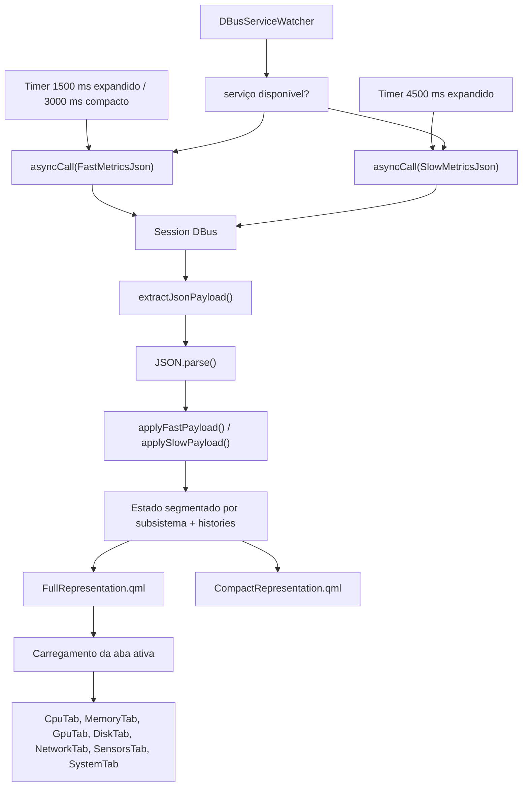

# Frontend — Plasmoid QML

O frontend é um **Plasma Applet** escrito em QML. Ele consome o JSON do backend via DBus, mantém estado local para histórico e renderiza a interface compacta e o popup expandido.

---

## Estrutura de arquivos

```text
plasma/contents/ui/
├── main.qml                   # polling DBus, estado global e histórico
├── CompactRepresentation.qml  # resumo compacto no painel
├── FullRepresentation.qml     # popup completo com TabBar fixa
├── Theme.qml                  # design system: cores, espaçamentos e formatadores
├── components/                # componentes reutilizáveis
└── tabs/                      # conteúdo de cada aba
```

---

## Fluxo de dados no frontend



---

## Estado global em `main.qml`

### Payload atual (`metrics`)

O objeto `metrics` inicial já contempla os campos mais recentes do contrato:

- `network.gateway_ip`
- `network.gateway_latency_ms`
- `top_processes`
- `gpus[*].fan_duty_percent`

> `SensorMetrics` no estado inicial ainda usa apenas campos essenciais; os campos opcionais novos chegam do backend no primeiro `applyMetrics()`.

### Polling e cliente DBus

`main.qml` usa um cliente DBus persistente do Plasma Workspace:

- `import org.kde.plasma.workspace.dbus 1.0 as DBus`
- `DBus.SessionBus.asyncCall(...)`
- `DBus.DBusServiceWatcher`

Regras atuais de atualização:

- timer rápido: `1500 ms` quando o popup está **expandido**;
- timer rápido: `3000 ms` quando o widget está apenas no modo **compacto**;
- timer lento: `4500 ms` quando o popup está **expandido**;
- `fastFetchInProgress` / `slowFetchInProgress` evitam chamadas sobrepostas;
- ao expandir o popup, o frontend dispara coleta imediata dos caminhos rápido e lento;
- se o backend ainda não expuser `FastMetricsJson` / `SlowMetricsJson`, o frontend recua automaticamente para `GetMetricsJson`.

### Estado global segmentado

O frontend não usa mais um único `root.metrics` substituído por completo a cada resposta.

Em vez disso, o estado foi segmentado em propriedades por subsistema:

- `cpuMetrics`
- `memoryMetrics`
- `diskMetrics`
- `networkMetrics`
- `sensorMetrics`
- `gpuMetrics`
- `topProcesses`
- `systemInfoMetrics`
- `uptime`
- `loadAverage`

Isso reduz invalidação global de bindings e evita repassar um snapshot monolítico para toda a árvore QML.

### Histórico acumulado

| Propriedade | Conteúdo | Calculado em |
|---|---|---|
| `cpuHistory` | `cpu.usage_percent` | `applyMetrics()` |
| `memoryHistory` | `memory.usage_percent` | `applyMetrics()` |
| `networkDownloadRate` | delta local de bytes recebidos | `applyMetrics()` |
| `networkUploadRate` | delta local de bytes enviados | `applyMetrics()` |
| `networkDownloadHistory` | histórico de download | `applyMetrics()` |
| `networkUploadHistory` | histórico de upload | `applyMetrics()` |
| `diskReadRate` | `disk.total_read_bytes_per_sec` | `applyMetrics()` |
| `diskWriteRate` | `disk.total_write_bytes_per_sec` | `applyMetrics()` |
| `diskReadHistory` | histórico de leitura de disco | `applyMetrics()` |
| `diskWriteHistory` | histórico de escrita de disco | `applyMetrics()` |
| `gpuHistory` | `gpus[0].usage_percent` | `applyMetrics()` |

O histórico é circular e usa:

- `expandedSampleIntervalMs = 1500`
- `compactSampleIntervalMs = 3000`
- `historyDurationMs = 5 * 60 * 1000`
- `historyLength = ceil(historyDurationMs / expandedSampleIntervalMs)`

Para reduzir trabalho em segundo plano, os históricos detalhados só são atualizados quando o popup está **expandido**.

Além disso, os históricos passaram a usar um buffer circular lógico, evitando `slice(0)` + `shift()` em cada amostra.

---

## Abas

| Índice | Aba | Arquivo | Props principais |
|---|---|---|---|
| 0 | CPU | `CpuTab.qml` | `metrics`, `history`, `historyDurationMs` |
| 1 | RAM | `MemoryTab.qml` | `metrics`, `history`, `historyDurationMs` |
| 2 | GPU | `GpuTab.qml` | `metrics`, `gpuHistory`, `historyDurationMs` |
| 3 | Disk | `DiskTab.qml` | `metrics`, `diskReadHistory`, `diskWriteHistory`, `diskReadRate`, `diskWriteRate` |
| 4 | Network | `NetworkTab.qml` | `metrics`, `downloadHistory`, `uploadHistory`, `downloadRate`, `uploadRate`, `historyDurationMs` |
| 5 | Sensors | `SensorsTab.qml` | `metrics` |
| 6 | System | `SystemTab.qml` | `metrics` |

### CPU — `CpuTab.qml`

- hero com temperatura, gauge de uso total e load de 1 minuto;
- usa **diretamente** `metrics.sensors.hottest_cpu_celsius` e `hottest_cpu_label`;
- histórico de uso da CPU;
- detalhes de `user`, `system`, `idle`, `steal` e uptime;
- grade por núcleo e load average.

### RAM — `MemoryTab.qml`

- hero com memória livre, uso total e swap;
- histórico de uso;
- detalhes de RAM usada, disponível e swap.

### GPU — `GpuTab.qml`

- suporta GPU primária com visual completo e GPUs secundárias em cards compactos;
- hero com temperatura, gauge de uso e potência;
- histórico de uso da GPU primária;
- seção de VRAM e clocks;
- exibe `fan_rpm` e, quando disponível, `fan_duty_percent` no hero e em details.

### Disk — `DiskTab.qml`

- uso do disco principal com barra de progresso;
- atividade de leitura e escrita em tempo real;
- histórico de I/O;
- partições secundárias em seções compactas.

### Network — `NetworkTab.qml`

- hero com download e upload instantâneos;
- histórico separado de download e upload;
- card de **teste de velocidade manual** com botão de iniciar/cancelar;
- details com as interfaces mais ativas;
- exibe `gateway_ip` e `gateway_latency_ms` quando disponíveis;
- usa cor dinâmica para latência: verde, amarelo ou vermelho conforme o valor.

O speed test usa um fluxo separado do polling normal:

- `StartNetworkSpeedTest` para iniciar;
- `GetNetworkSpeedTestStatusJson` para consultar estado;
- `CancelNetworkSpeedTest` para cancelar;
- timer dedicado de `1000 ms` no frontend apenas enquanto o teste estiver em execução.

### Sensors — `SensorsTab.qml`

- hero com estado geral, pico de temperatura e ventilação;
- temperaturas por chip;
- fans com RPM e duty cycle quando disponível;
- listas de tensão, corrente e potência.

### System — `SystemTab.qml`

- hero com uptime, total de processos e arquitetura;
- card do sistema operacional;
- card de load average;
- lista dos **15 processos com maior uso de CPU**;
- a antiga visão resumida de recursos foi substituída pelo ranking de processos.

---

## Design system — `Theme.qml`

### Paleta de cores

| Propriedade | Uso |
|---|---|
| `cpuColor` | CPU, download |
| `memoryColor` | RAM, VRAM |
| `swapColor` | Swap |
| `diskColor` | Disco |
| `networkColor` | Rede |
| `gpuColor` | GPU |
| `systemColor` | Informações gerais |
| `successColor` | Status saudável / ativo |
| `warningColor` | Estado intermediário |
| `dangerColor` | Estado crítico |

### Utilitários usados pelas abas

| Função | Descrição |
|---|---|
| `theme.fmtUptime(s)` | Formata uptime como `Xd Yh Zm` |
| `theme.fmtBytes(v)` | Formata bytes com unidade automática |
| `theme.fmtRate(v)` | Formata taxa em bytes por segundo |
| `theme.fmtOne(v)` | Uma casa decimal com fallback seguro |

---

## Resumo técnico

O frontend mantém apenas lógica de apresentação e derivação leve. Com as mudanças recentes, houve uma redução de lógica duplicada e de overhead no QML:

- a temperatura principal da aba CPU agora vem pronta do backend;
- a latência do gateway chega pronta no payload de rede;
- a aba System consome `top_processes` diretamente do backend;
- o detalhe de `fan_duty_percent` da GPU passou a ser exibido sem necessidade de cálculo local;
- o polling deixou de usar subprocesso `gdbus call` e passou a usar cliente DBus persistente assíncrono;
- o caminho quente passou a consumir payload DBus reduzido (`FastMetricsJson`);
- o estado QML deixou de ser substituído como um objeto monolítico;
- os históricos deixaram de copiar arrays inteiros em cada amostra;
- o teste manual de velocidade foi isolado em um fluxo DBus próprio, fora do polling contínuo.
