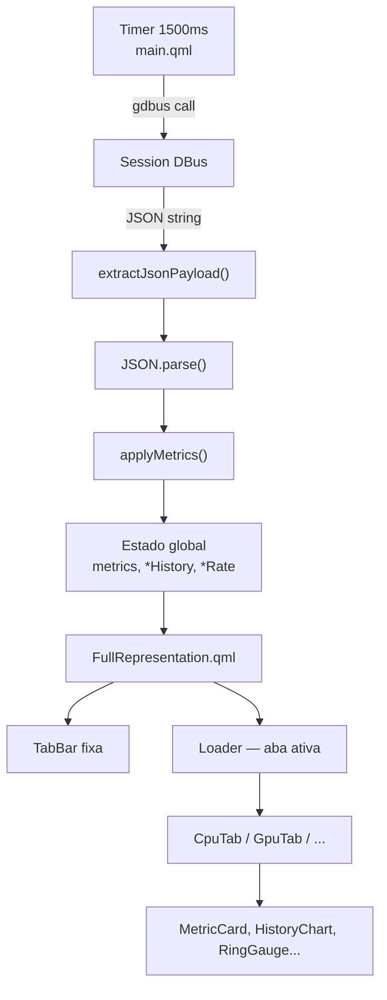

# Frontend — Plasmoid QML

O frontend é um **Plasma Applet** escrito em QML. Consome o JSON do backend via DBus e renderiza 7 abas com métricas em tempo real.

---

## Estrutura de Arquivos

```
plasma/contents/ui/
├── main.qml                   # orchestração: polling DBus, histórico, estado global
├── CompactRepresentation.qml  # exibição no painel (CPU% | RAM%)
├── FullRepresentation.qml     # popup: header fixo + TabBar + ScrollView
├── Theme.qml                  # design system: paleta, espaçamentos, funções utilitárias
├── Popup.qml                  # configurações do popup Plasma
├── components/                # componentes reutilizáveis
└── tabs/                      # conteúdo de cada aba
```

---

## Fluxo de Dados no Frontend



---

## Histórico acumulado

| Propriedade | Conteúdo | Calculado em |
|---|---|---|
| `cpuHistory` | `usage_percent` amostrado a cada 1500ms | `applyMetrics` |
| `memoryHistory` | `memory.usage_percent` | `applyMetrics` |
| `networkDownloadRate` | bytes/s de download calculado por delta | `applyMetrics` |
| `networkUploadRate` | bytes/s de upload calculado por delta | `applyMetrics` |
| `diskReadRate` | bytes/s de leitura (total de discos) | `applyMetrics` |
| `diskWriteRate` | bytes/s de escrita (total de discos) | `applyMetrics` |
| `gpuHistory` | `gpus[0].usage_percent` | `applyMetrics` |

O histórico é uma array circular de tamanho `historyLength = historyDurationMs / sampleIntervalMs` (padrão: `5 min / 1500 ms ≈ 200 amostras`).

---

## Abas

| Índice | Aba | Arquivo | Props recebidas |
|---|---|---|---|
| 0 | CPU | `CpuTab.qml` | `metrics`, `history` (cpuHistory), `historyDurationMs` |
| 1 | RAM | `MemoryTab.qml` | `metrics`, `history` (memoryHistory), `historyDurationMs` |
| 2 | GPU | `GpuTab.qml` | `metrics`, `gpuHistory`, `historyDurationMs` |
| 3 | Disk | `DiskTab.qml` | `metrics`, `diskReadHistory`, `diskWriteHistory`, `diskReadRate`, `diskWriteRate` |
| 4 | Network | `NetworkTab.qml` | `metrics`, `downloadHistory`, `uploadHistory`, `downloadRate`, `uploadRate`, `historyDurationMs` |
| 5 | Sensors | `SensorsTab.qml` | `metrics` |
| 6 | System | `SystemTab.qml` | `metrics` |

### Conteúdo de cada aba

**CpuTab** — Hero (temperatura CPU, uso% gauge, load 1m), Usage history, Details (user/system/idle/steal/uptime), Core usage grid, Average load (1/5/15 min), Frequency.

**MemoryTab** — Hero (livre, uso% gauge, swap), Usage history, Details (usada, livre, swap).

**GpuTab** — Hero (temperatura, uso% gauge, potência), Usage history, VRAM (barra + valores), Details (shader clock, mem clock, fan, driver). Suporta múltiplas GPUs: primária completa, secundárias em cards compactos.

**DiskTab** — Hero (disco principal: uso%, barra, livre), I/O Activity (HeroMetric + dois HistoryChart), Partições secundárias (MetricBar + capacidade).

**NetworkTab** — Hero (download/upload HeroMetric), Usage history (dois charts separados), Details (interfaces com status UP/DOWN, bytes recebidos/enviados).

**SensorsTab** — Hero (estado, pico, fans), Fans (RPM + duty%), Temperature (agrupada por chip: CPU/GPU/NVMe/Sistema), Voltage, Current (cards lado a lado), Power.

**SystemTab** — Hero (hostname, uptime, processos, arquitetura), SO (distribuição, kernel, hostname), Load average (três HeroMetric), Recursos (CPU, RAM, swap, disco, rede, temperatura em um único card).

---

## Design System — Theme.qml

### Paleta de cores

| Propriedade | Valor | Uso |
|---|---|---|
| `cpuColor` | `#60a5fa` | CPU, download |
| `memoryColor` | `#c084fc` | RAM, VRAM |
| `swapColor` | `#a78bfa` | Swap |
| `diskColor` | `#34d399` | Disco |
| `networkColor` | `#f59e0b` | Rede |
| `gpuColor` | `#f97316` | GPU |
| `systemColor` | `#94a3b8` | Info do sistema |
| `successColor` | `#22c55e` | OK / ativo / UP |
| `warningColor` | `#f59e0b` | Alerta (70–84°C) |
| `dangerColor` | `#ef4444` | Crítico (≥85°C) / DOWN |

### Funções utilitárias

| Função | Descrição |
|---|---|
| `theme.fmtUptime(s)` | Formata segundos como `"Xd Yh Zm"` |
| `theme.fmtBytes(v)` | Formata bytes com unidade automática (B→TB) |
| `theme.fmtRate(v)` | `fmtBytes(v) + "/s"` |
| `theme.fmtOne(v)` | `Number(v).toFixed(1)` com fallback `"0.0"` |
