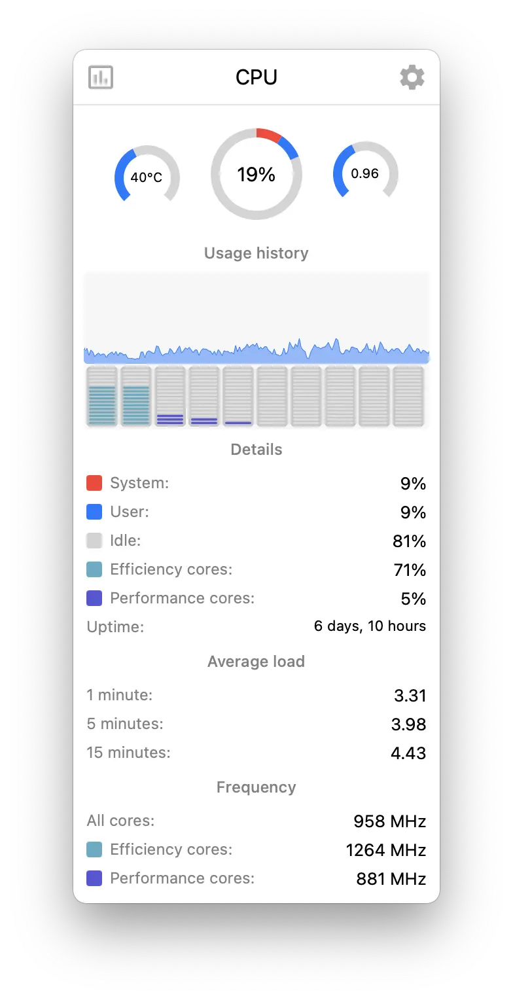

# Referência visual — CPU

Arquivo de imagem: `referencias/cpu.webp`

## Descrição

Esta imagem mostra a tela expandida da aba **CPU** do monitor de sistema para KDE Plasma.

## Elementos visuais principais

- **Cabeçalho** com o título `CPU`
- **Indicadores circulares** no topo para:
  - temperatura da CPU (`40°C`)
  - uso total da CPU (`19%`)
  - load average (`0.96`)
- **Seção "Usage history"** com gráfico de área azul exibindo o histórico recente de uso
- **Grade de núcleos** com barras individuais por core, mostrando atividade separada
- **Seção "Details"** com métricas detalhadas:
  - `System: 9%`
  - `User: 9%`
  - `Idle: 81%`
  - `Efficiency cores: 71%`
  - `Performance cores: 5%`
  - `Uptime: 6 days, 10 hours`
- **Seção "Average load"** com médias de carga em:
  - 1 minuto (`3.31`)
  - 5 minutos (`3.98`)
  - 15 minutos (`4.43`)
- **Seção "Frequency"** com frequências atuais:
  - todos os núcleos (`958 MHz`)
  - efficiency cores (`1264 MHz`)
  - performance cores (`881 MHz`)

## Estilo visual

- **Visual limpo e minimalista**, com bastante espaço em branco
- **Cartão com cantos arredondados**, sugerindo um painel flutuante típico de widgets do Plasma
- **Paleta clara** predominante, com fundo branco ou cinza muito claro
- **Uso de azul como cor principal** para indicar atividade e métricas positivas/ativas
- **Uso de vermelho** para destacar a fatia de uso do sistema no gauge central
- **Uso de cinza claro** como base neutra em trilhas, divisórias e estados inativos
- **Tipografia simples e legível**, com títulos centralizados e valores numéricos em maior destaque
- **Ícones discretos no topo**, mantendo o foco nas métricas
- **Hierarquia visual forte**, separando claramente resumo, histórico e detalhes técnicos

## Layout

O layout segue uma organização vertical em blocos bem definidos:

1. **Barra superior / cabeçalho**
   - ícone à esquerda
   - título `CPU` centralizado
   - ícone de configuração à direita

2. **Linha de indicadores resumidos**
   - três gauges alinhados horizontalmente
   - o gauge central é maior, funcionando como métrica principal
   - os gauges laterais atuam como métricas auxiliares

3. **Bloco de histórico de uso**
   - título da seção centralizado
   - gráfico ocupando uma faixa larga horizontal
   - logo abaixo, uma grade de núcleos individuais em miniatura

4. **Bloco de detalhes**
   - título da seção centralizado
   - lista vertical de métricas com marcador colorido à esquerda e valor alinhado à direita
   - organização em formato de tabela simples de duas colunas

5. **Blocos adicionais de métricas agregadas**
   - `Average load`
   - `Frequency`
   - ambos seguem o mesmo padrão: título centralizado e linhas com rótulo à esquerda e valor à direita

## Objetivo da referência

Esta referência pode ser usada para:

- guiar a implementação visual da aba de CPU no plasmoid
- validar espaçamento, hierarquia e agrupamento das informações
- comparar a interface atual com o layout esperado
- reproduzir a organização das métricas principais e secundárias
