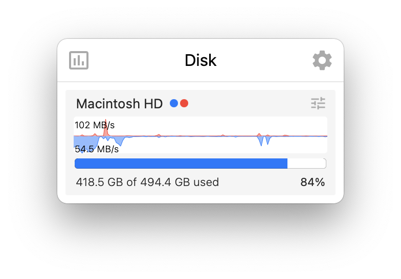

# Referência visual — Disk

Arquivo de imagem: `referencias/disk.webp`

## Descrição

Esta imagem mostra a tela expandida da aba **Disk** do monitor de sistema para KDE Plasma.

## Elementos visuais principais

- **Cabeçalho** com o título `Disk`
- **Cartão interno do volume** com o nome `Macintosh HD`
- **Indicadores coloridos** ao lado do nome do disco, sugerindo leitura e gravação
- **Ícone de ajuste/filtro** no canto superior direito do cartão interno
- **Gráfico de atividade** com linhas e áreas em azul e vermelho, representando tráfego de disco ao longo do tempo
- **Valores instantâneos de throughput** exibidos à esquerda do gráfico:
  - `102 MB/s`
  - `54.5 MB/s`
- **Barra de progresso horizontal** mostrando o uso de armazenamento
- **Resumo de capacidade** na parte inferior:
  - `418.5 GB of 494.4 GB used`
  - `84%`

## Estilo visual

- **Visual compacto e minimalista**, com foco em um único dispositivo de armazenamento
- **Cartão principal com cantos arredondados**, consistente com o restante da interface
- **Paleta clara**, com fundo branco ou cinza muito claro
- **Azul como cor predominante**, usado para atividade principal e barra de ocupação
- **Vermelho como cor secundária**, indicando uma segunda dimensão de atividade no gráfico
- **Elementos internos agrupados em um subcartão**, reforçando a ideia de item/lista de discos
- **Tipografia simples e legível**, com destaque para nome do volume, capacidade e percentual
- **Baixa densidade visual**, favorecendo leitura rápida e status imediato

## Layout

O layout segue uma organização vertical simples e centrada em um único bloco principal:

1. **Barra superior / cabeçalho**
   - ícone à esquerda
   - título `Disk` centralizado
   - ícone de configuração à direita

2. **Cartão do disco**
   - nome do volume na parte superior
   - pequenos indicadores coloridos ao lado do nome
   - ícone de ajuste/listagem à direita

3. **Área de atividade**
   - gráfico horizontal logo abaixo do título do disco
   - valores de taxa alinhados à esquerda
   - linhas/áreas azul e vermelha para indicar variações de I/O

4. **Área de uso de capacidade**
   - barra de progresso horizontal abaixo do gráfico
   - texto de capacidade ocupada à esquerda
   - percentual total alinhado à direita

## Objetivo da referência

Esta referência pode ser usada para:

- guiar a implementação visual da aba de disco no plasmoid
- reproduzir o cartão resumido de um volume com atividade e ocupação
- validar proporções entre gráfico, barra de uso e textos de capacidade
- comparar a interface atual com o layout esperado
