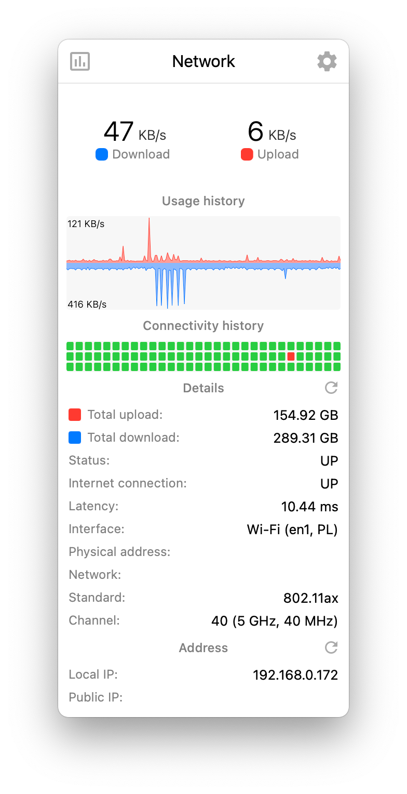

# Referência visual — Network

Arquivo de imagem: `referencias/network.webp`

## Descrição

Esta imagem mostra a tela expandida da aba **Network** do monitor de sistema para KDE Plasma.

## Elementos visuais principais

- **Cabeçalho** com o título `Network`
- **Dois indicadores numéricos principais** no topo:
  - `47 KB/s` para **Download**
  - `6 KB/s` para **Upload**
- **Marcadores coloridos** junto aos rótulos:
  - azul para download
  - vermelho para upload
- **Seção "Usage history"** com gráfico temporal bidirecional:
  - upload em vermelho acima da linha central
  - download em azul abaixo da linha central
- **Escala lateral** no gráfico com valores como `121 KB/s` e `416 KB/s`
- **Seção "Connectivity history"** com grade de pequenos blocos de status
  - maioria em verde, indicando conectividade estável
  - um bloco vermelho destacando falha/interrupção pontual
- **Seção "Details"** com dados acumulados e status da interface:
  - `Total upload: 154.92 GB`
  - `Total download: 289.31 GB`
  - `Status: UP`
  - `Internet connection: UP`
  - `Latency: 10.44 ms`
  - `Interface: Wi‑Fi (en1, PL)`
  - `Standard: 802.11ax`
  - `Channel: 40 (5 GHz, 40 MHz)`
- **Seção "Address"** com informações de IP:
  - `Local IP: 192.168.0.172`
  - `Public IP:` sem valor preenchido na captura
- **Ícones de atualização** ao lado de algumas seções, sugerindo refresh manual

## Estilo visual

- **Visual informativo e técnico**, com mais densidade de dados do que as demais abas
- **Cartão com cantos arredondados** e fundo claro
- **Paleta clara e neutra**, com cores funcionais para distinguir tipos de tráfego e estados
- **Azul e vermelho** como cores principais para download e upload
- **Verde** usado para indicar conectividade saudável/online
- **Tipografia limpa**, com números grandes no topo para destacar throughput atual
- **Separação forte por blocos**, permitindo leitura por seções: tráfego atual, histórico, conectividade, detalhes e endereço
- **Abordagem de dashboard vertical**, privilegiando leitura rápida seguida de inspeção detalhada

## Layout

O layout segue uma organização vertical em vários blocos:

1. **Barra superior / cabeçalho**
   - ícone à esquerda
   - título `Network` centralizado
   - ícone de configuração à direita

2. **Resumo de throughput atual**
   - dois blocos lado a lado
   - download à esquerda e upload à direita
   - valor em destaque com rótulo logo abaixo

3. **Bloco de histórico de uso**
   - título centralizado
   - gráfico horizontal de tráfego com eixo central
   - upload e download espelhados visualmente

4. **Bloco de histórico de conectividade**
   - título centralizado
   - grade horizontal de quadrados pequenos representando estados passados

5. **Bloco de detalhes**
   - título centralizado
   - linhas em formato de tabela simples, com rótulo à esquerda e valor à direita
   - inclui tráfego acumulado, status, latência e dados da interface Wi‑Fi

6. **Bloco de endereço**
   - título centralizado
   - lista de IPs em formato de tabela simples

## Objetivo da referência

Esta referência pode ser usada para:

- guiar a implementação visual da aba de rede no plasmoid
- reproduzir o contraste entre métricas instantâneas, histórico e detalhes técnicos
- validar o uso consistente de cores para upload, download e conectividade
- comparar a interface atual com o layout esperado
