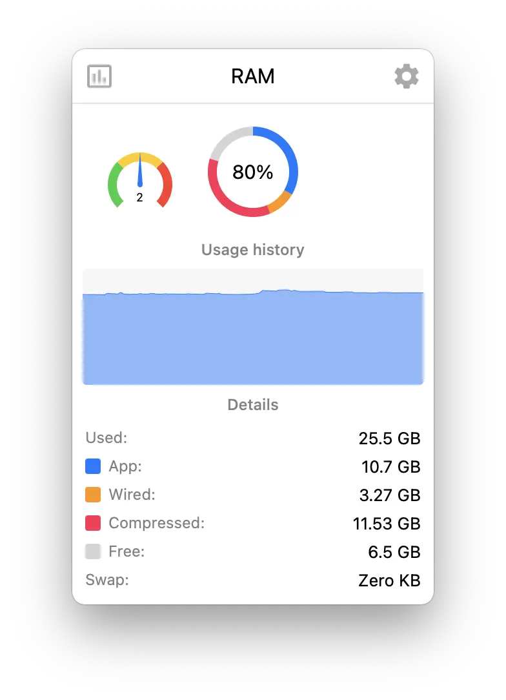

# Referência visual — RAM

Arquivo de imagem: `referencias/ram.webp`

## Descrição

Esta imagem mostra a tela expandida da aba **RAM** do monitor de sistema para KDE Plasma.

## Elementos visuais principais

- **Cabeçalho** com o título `RAM`
- **Indicador semicircular** à esquerda, com zonas coloridas e ponteiro central exibindo o valor `2`
- **Indicador circular principal** ao centro, mostrando o uso total de memória (`80%`)
- **Seção "Usage history"** com gráfico de área azul exibindo o histórico recente de uso da memória
- **Seção "Details"** com métricas detalhadas:
  - `Used: 25.5 GB`
  - `App: 10.7 GB`
  - `Wired: 3.27 GB`
  - `Compressed: 11.53 GB`
  - `Free: 6.5 GB`
  - `Swap: Zero KB`
- **Marcadores coloridos** ao lado de algumas linhas, ajudando a relacionar categorias de memória com as cores usadas no indicador principal

## Estilo visual

- **Visual limpo e minimalista**, com foco em leitura rápida
- **Cartão com cantos arredondados**, reforçando a aparência de widget flutuante
- **Paleta clara** com fundo branco ou cinza muito claro
- **Azul como cor predominante** no gráfico de histórico e em uma das categorias principais de memória
- **Cores vibrantes segmentadas** no gauge principal, diferenciando tipos de uso de memória
- **Indicador semicircular multicolorido** à esquerda, trazendo um elemento visual complementar ao resumo principal
- **Tipografia simples e legível**, com valores numéricos destacados à direita
- **Divisão visual por seções**, com títulos centralizados e bom espaçamento vertical
- **Uso moderado de sombras e contraste suave**, mantendo aparência moderna e leve

## Layout

O layout segue uma organização vertical em blocos bem definidos:

1. **Barra superior / cabeçalho**
   - ícone à esquerda
   - título `RAM` centralizado
   - ícone de configuração à direita

2. **Linha de indicadores resumidos**
   - um gauge semicircular menor à esquerda
   - um gauge circular maior ao centro, como elemento principal da tela
   - destaque visual concentrado no percentual total de uso

3. **Bloco de histórico de uso**
   - título da seção centralizado
   - gráfico de área largo, preenchendo quase toda a largura do cartão
   - leitura visual contínua do consumo de memória ao longo do tempo

4. **Bloco de detalhes**
   - título da seção centralizado
   - linhas de métricas em formato de tabela simples
   - rótulos à esquerda e valores alinhados à direita
   - algumas linhas usam quadrados coloridos para indicar categorias específicas

## Objetivo da referência

Esta referência pode ser usada para:

- guiar a implementação visual da aba de RAM no plasmoid
- validar hierarquia visual entre resumo, histórico e detalhamento
- reproduzir o uso de cores para categorias de memória
- comparar a interface atual com o layout esperado
