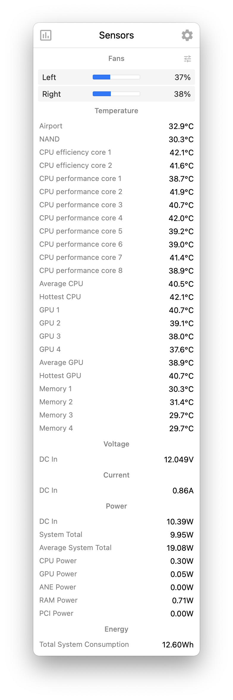

# Referência visual — Sensors

Arquivo de imagem: `referencias/sensors.webp`

## Descrição

Esta imagem mostra a tela expandida da aba **Sensors** do monitor de sistema para KDE Plasma.

## Elementos visuais principais

- **Cabeçalho** com o título `Sensors`
- **Seção "Fans"** com duas barras horizontais:
  - `Left: 37%`
  - `Right: 38%`
- **Ícone de ajuste/filtro** ao lado do título da seção de ventiladores
- **Seção "Temperature"** com uma lista extensa de sensores térmicos, incluindo:
  - `Airport`
  - `NAND`
  - `CPU efficiency core 1/2`
  - `CPU performance core 1–8`
  - `Average CPU`
  - `Hottest CPU`
  - `GPU 1–4`
  - `Average GPU`
  - `Hottest GPU`
  - `Memory 1–4`
- **Seção "Voltage"** com leitura de tensão:
  - `DC In: 12.049V`
- **Seção "Current"** com leitura de corrente:
  - `DC In: 0.86A`
- **Seção "Power"** com várias métricas de consumo:
  - `DC In: 10.39W`
  - `System Total: 9.95W`
  - `Average System Total: 19.08W`
  - `CPU Power: 0.30W`
  - `GPU Power: 0.05W`
  - `ANE Power: 0.00W`
  - `RAM Power: 0.71W`
  - `PCI Power: 0.00W`
- **Seção "Energy"** com consumo acumulado:
  - `Total System Consumption: 12.60Wh`

## Estilo visual

- **Visual técnico e altamente informativo**, priorizando listagem detalhada de sensores
- **Cartão com cantos arredondados** e fundo claro, consistente com as demais abas
- **Paleta neutra**, com azul usado apenas para barras de ventilação e elementos de destaque funcional
- **Tipografia simples e muito legível**, adequada para listas longas de métricas
- **Hierarquia baseada em títulos de seção**, em vez de gráficos grandes ou indicadores chamativos
- **Layout sóbrio e funcional**, com pouca ornamentação e grande densidade de informação textual
- **Ênfase em precisão**, com valores exibidos em °C, V, A, W e Wh

## Layout

O layout segue uma organização vertical longa, segmentada por categorias de sensores:

1. **Barra superior / cabeçalho**
   - ícone à esquerda
   - título `Sensors` centralizado
   - ícone de configuração à direita

2. **Seção de ventiladores**
   - título `Fans` centralizado
   - duas linhas com rótulo à esquerda, barra horizontal ao centro e percentual à direita

3. **Seção de temperatura**
   - título `Temperature` centralizado
   - longa lista em formato de tabela simples
   - nomes dos sensores à esquerda e temperaturas à direita

4. **Seção de voltagem**
   - título `Voltage` centralizado
   - poucas leituras resumidas em linhas simples

5. **Seção de corrente**
   - título `Current` centralizado
   - mesma estrutura de lista com valor à direita

6. **Seção de potência**
   - título `Power` centralizado
   - conjunto mais denso de métricas energéticas por subsistema

7. **Seção de energia acumulada**
   - título `Energy` centralizado
   - leitura final de consumo total do sistema

## Objetivo da referência

Esta referência pode ser usada para:

- guiar a implementação visual da aba de sensores no plasmoid
- reproduzir uma tela focada em listas técnicas com várias categorias de medição
- validar espaçamento, legibilidade e consistência entre seções longas
- comparar a interface atual com o layout esperado
