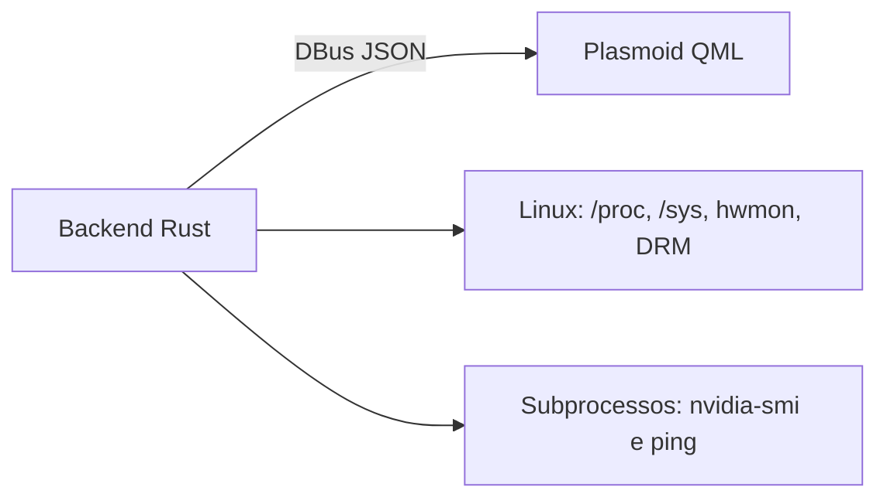

# Arquitetura

Esta página é uma **visão geral para contribuidores**. Ela resume como o projeto é dividido e aponta para a documentação técnica detalhada em `docs/`.

---

## Visão geral

O Monitor Tray separa **coleta de dados** e **apresentação**:

- **backend Rust**: coleta métricas do sistema Linux, monta snapshots JSON rápidos/lentos e expõe via Session DBus;
- **frontend QML**: consulta esses snapshots por um cliente DBus persistente assíncrono, separa polling rápido/lento, mantém histórico local e renderiza a UI do plasmoid.

Hoje, o caminho rápido (`FastMetricsJson`) é servido de um **cache quente** mantido pelo backend em background.

---

## Como o projeto está dividido

| Área | Papel |
|---|---|
| `src/` | Backend Rust: coleta, modelagem, DBus |
| `src/monitor/` | Núcleo da coleta: CPU, disco, rede, sensores, GPU |
| `plasma/contents/ui/` | Frontend QML do widget |
| `docs/` | Referência técnica detalhada |
| `wiki/` | Visão geral, onboarding e contribuição |

---

## Fluxo resumido

1. O backend atualiza o snapshot rápido em background e mantém `FastMetricsJson` em cache.
2. O frontend chama `FastMetricsJson` no caminho quente e `SlowMetricsJson` no caminho lento.
3. O backend atualiza CPU, memória, disco e rede separadamente de sensores, GPUs e processos.
4. O backend devolve JSONs menores por classe de métrica.
5. O QML aplica os dados por subsistema, recalcula históricos locais e re-renderiza só a parte necessária.

> O frontend não usa mais `gdbus call` como subprocesso por amostra; agora usa o módulo `org.kde.plasma.workspace.dbus`, faz fallback para `GetMetricsJson` apenas por compatibilidade e aplica pequeno debounce antes do primeiro fetch lento ao abrir o popup.

---

## O que mudou recentemente

Em alto nível, o projeto agora também expõe:

- latência do gateway padrão na aba **Network**;
- temperatura principal de CPU e GPU já derivada no backend;
- top processos por CPU na aba **System**;
- duty cycle do fan da GPU AMD quando disponível;
- teste manual de velocidade na aba **Network**;
- cache quente para o snapshot rápido do backend.

Os detalhes de implementação, fontes Linux e formato do payload estão documentados em `docs/`.

---

## Referência técnica

Use os documentos abaixo quando precisar de detalhes:

| Documento | Quando consultar |
|---|---|
| [`docs/architecture.md`](https://github.com/marcos2872/rust-monitor-tray/blob/main/docs/architecture.md) | Fluxo interno, módulos e decisões arquiteturais |
| [`docs/backend.md`](https://github.com/marcos2872/rust-monitor-tray/blob/main/docs/backend.md) | Coleta de métricas, DBus, subprocessos e testes |
| [`docs/models.md`](https://github.com/marcos2872/rust-monitor-tray/blob/main/docs/models.md) | Contrato JSON completo |
| [`docs/frontend.md`](https://github.com/marcos2872/rust-monitor-tray/blob/main/docs/frontend.md) | Estado QML, histórico e comportamento das abas |
