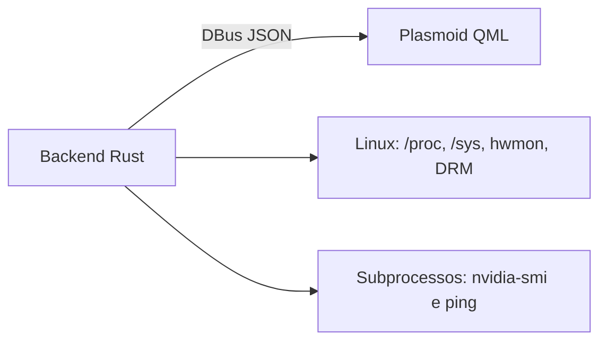

# Arquitetura

Esta página é uma **visão geral para contribuidores**. Ela resume como o projeto é dividido e aponta para a documentação técnica detalhada em `docs/`.

---

## Visão geral

O Monitor Tray separa **coleta de dados** e **apresentação**:

- **backend Rust**: coleta métricas do sistema Linux, monta um snapshot JSON e expõe via Session DBus;
- **frontend QML**: consulta esse snapshot a cada `1500 ms`, mantém histórico local e renderiza a UI do plasmoid.

---

## Como o projeto está dividido

| Área | Papel |
|---|---|
| `src/` | Backend Rust: coleta, modelagem, DBus |
| `src/monitor/` | Núcleo da coleta: CPU, disco, rede, sensores, GPU |
| `plasma/contents/ui/` | Frontend QML do widget |
| `docs/` | Referência técnica detalhada |
| `wiki/` | Visão geral, onboarding e contribuição |

---

## Fluxo resumido

1. O frontend chama `GetMetricsJson` via DBus.
2. O backend atualiza CPU, memória, disco, rede, sensores, GPUs e processos.
3. O backend devolve um JSON serializado.
4. O QML aplica os dados, recalcula históricos locais e re-renderiza a aba ativa.

---

## O que mudou recentemente

Em alto nível, o projeto agora também expõe:

- latência do gateway padrão na aba **Network**;
- temperatura principal de CPU e GPU já derivada no backend;
- top processos por CPU na aba **System**;
- duty cycle do fan da GPU AMD quando disponível.

Os detalhes de implementação, fontes Linux e formato do payload estão documentados em `docs/`.

---

## Referência técnica

Use os documentos abaixo quando precisar de detalhes:

| Documento | Quando consultar |
|---|---|
| [`docs/architecture.md`](https://github.com/marcos2872/rust-monitor-tray/blob/main/docs/architecture.md) | Fluxo interno, módulos e decisões arquiteturais |
| [`docs/backend.md`](https://github.com/marcos2872/rust-monitor-tray/blob/main/docs/backend.md) | Coleta de métricas, DBus, subprocessos e testes |
| [`docs/models.md`](https://github.com/marcos2872/rust-monitor-tray/blob/main/docs/models.md) | Contrato JSON completo |
| [`docs/frontend.md`](https://github.com/marcos2872/rust-monitor-tray/blob/main/docs/frontend.md) | Estado QML, histórico e comportamento das abas |
